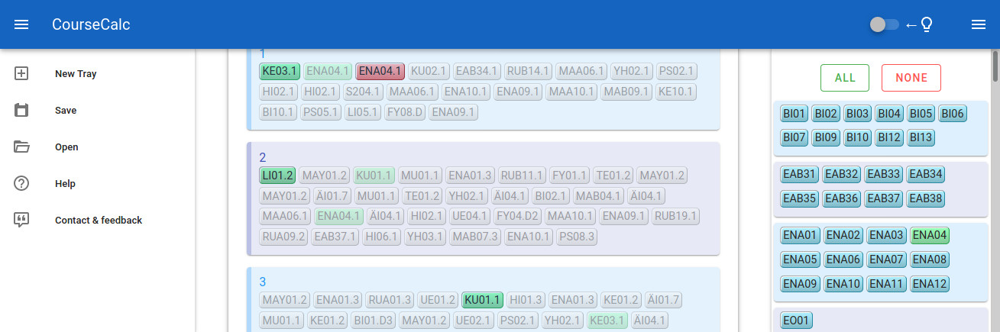

# coursecalc

Small VueJS practice project. Its purpose is to make it easier to plan the courses you have to select for the semester.


-   Show only the courses you have for the semester
-   Grays out already selected courses from elsewhere
-   Indicates selections clearly with green and red (or other colors, hue can be shifted!)
-   Save multiple plans to your browser's local storage

---

# project

## Project setup

```
npm install
```

### Compiles and hot-reloads for development

```
npm run serve
```

### Compiles and minifies for production

```
npm run build
```

### Lints and fixes files

```
npm run lint
```
